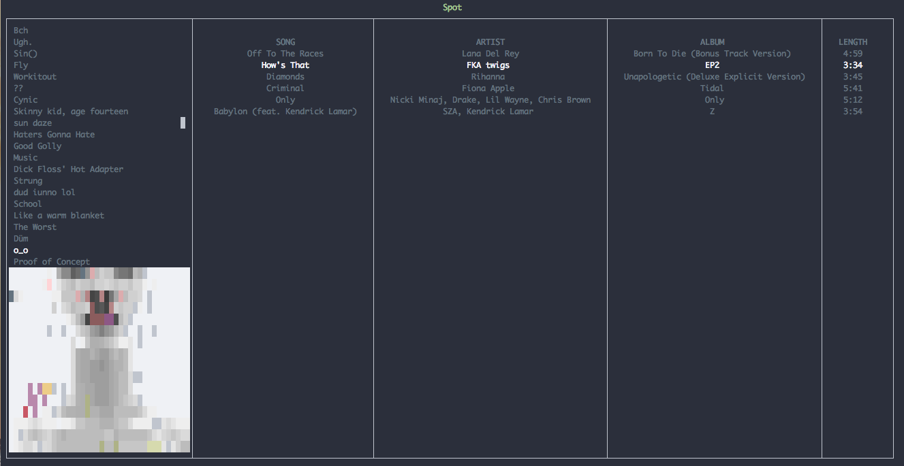

### A rewrite is coming!
Please treat all code here as deprecated. This was originally written when coffeescript was still relevant, and before Spotify had sunset its `libspotify`. Now that Spotify has a [web API](https://developer.spotify.com/web-api/start-a-users-playback), this theoretically be feasible once again. However, it deserves to be started over from scratch.

# spot
Spotify, in the worst way

# Usage
```bash
$ spot
```

# Contribute
```bash
$ git clone git@github.com:markalfred/spot.git
$ cd spot
$ npm install
$ npm link
$ spot
```

## TypeScript
Compile TypeScript files:
```npm run compile```


